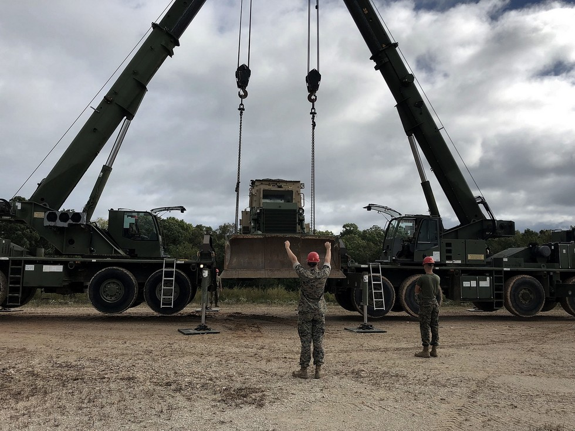

# My Name is: ***Blake D. Harris***
  I grew up on a small-town farm outside of Huntsville, AL. Our farm consisted of about 60 acres where we raised cattle and chickens. I was very athletic during school and participated in a variety of sports such as football, basketball, and baseball. After I graduated high school, I immediately joined the military, where I became an Engineer Equipment Operator, as illustrated in the pictures shown. In the first picture shown, we are performing a lifting technique known as a [tandem lift](https://www.spanco.com/tandem-lift-safe-practices/). 
## Tandem Lift 

## Hobbies
Some of the hobbies and activities I enjoy to do is hiking and staying physically fit

